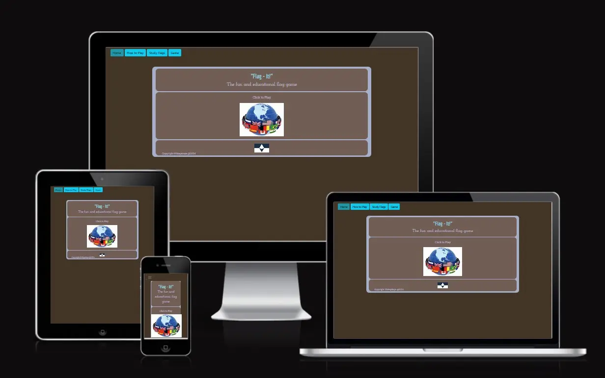

[PROJECT2FLAGIT](https://coelecanth.github.io/project2FlagIt)

[](https://github.com/Coelecanth/project2FlagIt/commits/main)
[](https://github.com/Coelecanth/project2FlagIt/commits/main)
[](https://github.com/Coelecanth/project2FlagIt)

# Flag-it! a JavaScript Game by  Stewart Gibbons



# Introduction 
I chose to write a game as I saw this as challenge and to stretch my knowledge of JavaScript. I chose a game as it was something I had never done before. This represented a technical challenge in managing a process of the game play. So as an example, managing the game flow, making sure only the right resources (buttons, menus) are available at the right time during the game flow. 

The games idea is to identify the national flags of the world, I chose this idea for several reasons. 
- Firstly, it something I am really interested in terms of travel and knowledge of other countries.

[View the live project here.](https://coelecanth.github.io/project2FlagIt//)

# Game Design Story 
The name I chose for the game was "Flag-it!", this being an obvious reference to flags; but also other reference to the colloquial term to highlight/illustrate something. Which given the game was all about finding the right name for a flag seemed appropriate. Lastly the expression of the words "flag-it" seemed very much to represent the spirit of the game of being fun and not too serious. 
Although there are similar names for other types of web application being Used "Flag-It!" was not being used by other games. 

So, when I started designing the game my initial idea for its requirement were to be visually pleasing and easy to understand without the need for significant explanation, more guidance. When I started researching further,  looking at similar types of game, this list grew significantly into the below criteria. 

- The game needed to be both educational and fun 
- Will be pleasing to use in terms of its colours, layout, and fonts
- layout should lend itself to divide the game play area into clearly understood regions e.g. 
    - Heading area
    - Flag area
    - Answer Area/panel 
    - Footer - with Copyright for the game and logos
    
- Need to have the minimum amount of scrolling when actually playing the game   
- Needed to be able to provide a complete list of all recognised country flags
- The flags name and flag image need to be accurate; this may seem obvious but a lot of images and names are wrong due to changes in the country. 
- The game needed to be written with HTML and JavaScript.
- Would also include the appropriate functional libraries for the above e.g. jQuery, Bootstrap 
## Game Features
Would include the following game features.
- Game score feature, counting during the game, and summary at the end.
- Would show the correct answer when answering questions if you get it wrong.
- Pause at the end of the game so I can if the last game answer was right or wrong. 
- Have a seperate learn the flags section where game player can look at all flags and become familiar with the flags of each country.
- Would be a multiple-choice question and answer game.
- Would show one flag image and multiple answer, this was chosen to give a better performance. when compared to display multiple images and a single answer.
- Would alter screen viewing pane to reduce the amount clutter and therefore scrolling when playing the game e.g. would hide elements that are not required such as the heading banner, text.
This will also be related to viewport size as well. 
- include all (the vast majority) of world flags as recognised by an authoritative body.
- Provide game options
    - To change the default number of questions to higher and lower number of questions.
    - High score feature - although technically this will only persist locally and to the browser. 
    - Provide access to different game types, e.g. flags by region. 
    - Alternative flag game - flags that are very similar in appearance to look at - "look-ee-likey game", and the answer would be all from same group of look-ee-likey flags.

## UX design 
So many of the features of the game I decided upon when researching the game were directly linked to the UX, these are detailed below 
- Game needed to be visually pleasing e.g. layout and spacing and colours, fonts. 
- It needed to be easier to understand with out explanation, more guidance. 
- The game needed to be both educational and fun, therefore engaging.  
- Need to have the minimum amount of scrolling when playing the game.   
    - When playing the game, it would alter screen viewing pane to reduce scrolling.
     e.g. would hide elements that are not required such as the heading banner, text.
- This same requirement would be necessary for responsiveness.   
- The layout should lend itself to divide the game play area into clearly understood regions e.g. 
    - Heading area
    - Flag area
    - Answer Area/panel 
    - Footer - with Copyright for the game and logos
    - this would further aid the idea of responsive design and game play, e.g. I can just hide panels I don’t need on the page. 
- Needed to be able to provide a complete list of all recognised country flags.
- The flags name and flag image need to be accurate. 
- Where beneficial the game should use appealing features like game modals and animation on buttons. 

## User Story
As this was a game the User story is probably a little different from most, but it is also linked to the UX design and overall features for the game. 

From a user perspective the game needed to be 
- Have a simple Navigational flow.
- Require no explanation to play the game, just pick it up and play. 
- Control the options/buttons in the game when playing to achieve the above. 
- The game should be both educational and fun. 
- Pleasing to use UX design colours, layout, and fonts, so not garish but inviting and fun. 
- the Game play areas should be clearly defined. 
    - The Question - flag panel 
    - The Answer - Answer panel 
    - Scores - Score Panel 
- Need to have the minimum amount of scrolling when playing the game.   
- Needed to be able to provide a complete list of all recognised country flags.
- include all (the vast majority) of world flags as recognised by an authoritative body.
- The flags name and flag image need to be accurate. 
- Game score feature, counting during the game, and summary at the end.
- Show the correct answer when answering questions if you get it wrong.
- Pause at the end of the game so I can if the last game answer was right or wrong. 
- Have a seperate learn the flags section where game player can look at all flags and become familiar with the flags of each country.
- Alter screen view to reduce the amount clutter and remove scrolling to a minimum.
- Provide game options.
    - To change the default number of questions to higher and lower number of questions.

## Colour Scheme
Given the above features, I wanted a colour scheme that would provide contrast across the majority of the flags I wanted to show, and would be appealing.
I used the web site [coolors](https://coolors.co/) to find a colour scheme palette. The colour scheme design for this game that I chose, is to provide a passive game palette that had good contrast, and was not to sombre, as I wanted the game to be fun. 
I chose the below colour scheme.   

I used the colour scheme exclusively in my styling of the game (see below my CSS excerpt) but also added some highlight colours on the buttons to make them easily identifiable over the cooler colour scheme, and give the game some focus and fun.
```css
    /* #8edce6 - non-photo blue */
    /* #d5dcf9 - lavender */
    /* #a7b0ca  - powder blue */
    /* #725e54 - Umber */
    /* #443627 - Taupe  */
```

## Typography
The fonts I used were chosen from [Fontjoy.com](https://fontjoy.com/) which provides a mechanism to mix and match together fonts to provide aesthetically pleasing results, using there deep learning algorithm to produce matching fonts. 

The following 3 fonts were chosen to provide good contrast in styles to each other and be empathise with the fun feel to the site.
I particularly liked the Economica font as when it is used in italic its shape and form look something like a waving flag. 
 - Economica - used for Heading and the waving Flag in italic
 - Josefin Slab - used for Subheading 
 - Roboto Slab - used throughout as the default font 

I created an import statement to import these from Google, this was included in my style.ccs file, to download and include these in my game.

## Images
### Image Sources 
The digital image material required for the flag images are public domain, 
I deliberately chose a single reliable source to acquire these images from. I acquired all the flag Images from [The CIA World Fact Book](https://www.cia.gov/the-world-factbook/references/flags-of-the-world/)
The reasoning for this was that a lot of the flag images available and there country are wrong due to names changes or changes in national status, such as:
- Czechia, formerly Czech Republic
- Eswatini, formerly Swaziland
So, using this site where both the image and are believed to be correct was the reason for this decision. In addition because of the purpose of the site I was able to procure a full set of 233 flags. 

The additional images I acquired for the game were obtained commercially through [IStock](https://www.istockphoto.com/) and this is used in the game on the home page [Flag Globe image](https://www.istockphoto.com/photo/world-flags-gm1140177392-305019555?searchscope=image%2Cfilm)
 
#### The umgpage.html 
The other images that I used for the game were manufactured by myself, 
the images that were created are:

- [Favicon](assets/img/flagiticon-1.avif)
- [Game Start flag Icon](assets/img/start-game-new.avif)

Using a web a page called [umpage.html](https://coelecanth.github.io/project2FlagIt/umgpage.html), I used the site colours and type formatting and styling to create the above web page as this was a very easy task having built the web site pages already. From this I then used a screen grab program, (windows snipit) to create the correct magnified image size in terms of the scale. These were then saved and then transformed from jpg to Avif, to make them web friendly.  

### Wireframes
I produced wireframe for the game to illustrate the screen layout. I've used [Balsamiq](https://balsamiq.com/wireframes) to design my site wireframes.

| Wireframes for the Game | 
| ------------------------| 
| The below images show the Game home page and its make up  | 
|  |
| The below image shows the Game play page.  The image shown is the game screen in its original guise with the game play buttons shown left and right of the flag image. Due to an issue that was found with responsiveness, I had to change this format. Now all the buttons appear underneath the image. This is documented in the testing section of this README.md |
|  |  
| The below image shows the How to play page |
|  |
| The below image shows the study the flags page |                    
|  |

# Site Design Development  
## Site model 
Initially I was working on site structure that would have had 2 pages utilising modals to reduce duplication of similar pages. It quickly became apparent that the modal structure became too complicated to manage and develop in the time I had to complete this. With this consideration I reverted to a more conventional structure using multiple pages. However, I still retained the modal pages for both the "end of game" screen and for the "game options" panel. My eventual site structure is shown in the wireframes section.

## Page Structure for UX
To give the game not only the look and feel I wanted but also the idea of responsiveness and allowing me to remove content dynamically, I divided the pages on the page into several structured and repeatable panels as I was going to have to reuse the page structure. 
The pages for the site comprise of the following structure. 
- Heading Banner 
- Flag Banner 
- Answer Banner 
- Score Banner 
- Copyright Banner 
This allowed me to have, not only a consistent look and feel but applying styles to pages was far easier as it was consistent across pages.

In addition to this there are 2 modal pages used from the game 
these are. 
- End of Game Modal 
- Game Options Modal 
this as both present on the game page

### Game Page 
The Panel layout was used in full on this page Within the Panel I also used bootstrap grid, and Bootstrap was also used to make panels, text and icons. 
 be responsive by removing them when not needed. 
 The game page has 2 JavaScript files associated with it one for the game, and a second which contains the JSON Array/dictionary for the flags and their attributes. 

### Study the Flags page
 Originally, I wanted to use a modal driven panel to show all flags and then be able to open one of these and view it. 
 To do this effectively I would have to understood data and Iso for div tags, and I just did not have the time to invest in this.
 So, I reverted back to using a page and then reusing a simplified version of the game page JavaScript which would retrieve and load a single flag on the click of a button. 
 In essence this page has its own JavaScript for the page which is a stripped down version of the game JavaScript and still shares the JSON Array/dictionary for the flags. 

## Future Features 
There are a few features which didn’t make it into this version of the game and that I would have liked to have developed, these are: 
- All Time high Scores
- Multi Region Game
- The Look-ee-like-ee Game
- Where is that from?    

The following sections details the progress I made with these 
### Future Developments
#### All Time High Scores  
 One feature which i would have liked to include in the game is to have persistent scores for 
 all time high score.
 The following code was trialled and updates the modal page to show this but in its current guise only persists in the current session of the game. 
 Once the page has been reloaded this information is lost. To enhance this further, development is needed to add using "localstorage" to store this information in a cookie, and then this would persist in the game for that browser on that machine, ideally a backend solution is required to store the game high scores, where a web service would capture during the data during game play and then store this, this then could be restored from the web service when a new session is started, regard less of browser and/or machine.   

```javascript 
function gethighScores() {
// check high scores
hScoreValQ = parseInt(hScore.innerText, 10) 
hScoreTotQ = parseInt(hScoreQ.innerText, 10)

// read high score from modal checks > x then set value 
if (correctQuestions.innerText > hScoreValQ) {
    $("#h-score").text(correctQuestions.innerText)
    $("#h-score-q").text(maxQuestions)
}
}  
```    
#### Multi Region Game 
I was developing a new feature for the game where you could select a region in the world where flags were from these were idenitified by 
field in the JSON array called territory. 
There are 5 territories contained in flag-dict.js which are  
- Asia 
- Oceania  
- Americas 
- Europe 
- Africa   
 
 Code below would firstly take input from the button shown in the modal game options. The id from the button is the same 
 as the value in territory e.g. "(id Oceania) == (territory  Oceania)", once this has been captured a negative match ("!= All") is made. Then the 
 the function arrFilter is called passing the id to the function from here new array is loaded and shuffled to produce the chosen scope
 The initNewgame function is called to start the game.   
 
 ```javascript 
    //captures input from modal  
    //change game type, eg capture flags a region
    modChgFg()
    function modChgFg() {
       $('.f-class').on("click", function () {
       gameFilter = (this.id); 
       if (gameFilter != "All") {
         // call function to create new arry with territory filter
        arrFilter(gameFilter)
         //show text with game type on page
        $(".ps-game").show();
        $("#" + "flag-game-type").html(gameFilter + ` Flags`)
        initNewgame(filteredArr)
    } else { 
         // gameFilter is set to "All" 
         //once closed now start game
        $("#GameEndModal").on("hide.bs.modal", function () {
        initNewgame("All")
        });
       }
      });
     }
    function arrFilter(idRegion) {
        let filteredArr = [];
        for (let i = 0; i < shuffled.length; i++) {
            if (shuffled[i].territory === idRegion) {
                filteredArr = [...filteredArr, shuffled[i]];
            }
        }
    }
```

This feature was included, but requires more work to complete, by revising the initNewgame, to accept both inputs from the regions and all flags (e.g. current game flow), 
Together with associated testing required to check for alterations in the game flow and there fore erroneous states.  

#### The Look-ee-like-ee Game 
I was developing a new feature for the game where you could a select game which selected a grouping of flags which are similar in colour and make up.  
To enable this feature, I extend the JSON file flag-dict.js and added a further named value in it of "lookelike" this contains a number which represent a grouping of flags, there are 47 Flag groupings.
The game would consist of loading 47 groups with an array of 4 flags in each, and then the game would be of 47 questions, with a different flag group for each question. The following code example show the structure of the JSON file. The full file has been included /assets/js/flag-dict2.js 
 ```javascript
    const countryArray = [
    {
      "country": "Afghanistan",
      "flag-name": "AF-flag.jpg",
      "territory": "Asia",
      "lookelike": 4
    },
    {
      "country": "Albania",
      "flag-name": "AL-flag.jpg",
      "territory": "Europe",
      "lookelike": 33
    },
    {
      "country": "Algeria",
      "flag-name": "AG-flag.jpg",
      "territory": "Africa",
      "lookelike": 18
    },
    ]
```
#### Where is that from? 
Where is that from or WITF is really an idea, at present. Where the game would present you with a Flag and then ask you to correctly identify the correct geography (territory) from where its from, such A: Oceania, B: Europe, C: Asia, D: Americas. 
The territory could be shuffled to give you more variety in the Questions. This somewhat departs from the flag idea as this now becomes more a geography knowledge quiz.    

# Technologies Used 

## Languages
1. HTML5
2. CSS3
3. Javascript 

## Frameworks, Libraries, Sites, Services & Programs Used
### 1. [Bootstrap 5.3](https://getbootstrap.com/docs/5.3/getting-started/introduction/)
- Bootstrap was used to assist with the capabilities and responsiveness and styling of the website. It is used throughout the site.
### 2. [jQuery ](https://jquery.com)  
- jQuery was used extensively to control and alter the HTML elements within the page. 
### 3. [Git](https://git-scm.com/) 
- Git was used for version control by utilizing the Gitpod terminal to commit to Git and Push to GitHub.
### 4. [GitHub:](https://github.com/) 
- GitHub is used to store the projects code after being pushed from Git.
### 5. [GitPod](https://www.gitpod.io/)
- Gitpod was the IDE that I used to edit and build the html pages in, and develop an debug the JavaScript code with. 
 ### 6. [Squoosh](https://squoosh.app/)
- Squooosh was used to perform the following functions 
- convert the images from jpg to Avif 
- Also to resize (reduce pixel count) the images to a more manageable size to improve download speed.
### 7. [Google Fonts](https://fonts.google.com/)
- Google fonts was used to source the fonts that were selected from Fontjoy. 
### 8. [StackOverflow](https://stackoverflow.com/) 
- Stack overflow was an invaluable resource I used for code validation, examples and research.
### 9. [FontJoy](https://fontjoy.com/)
- Font joy was used in the design process to create a palette of fonts, to be empathic with the site topic, and provide contrast between various type styling. 
- **Quote** from https://fontjoy.com/  
 *The goal of font pairing is to select fonts that share an overarching theme yet have a pleasing contrast. Which fonts work together is largely a matter of intuition, but we approach this problem with a neural net.*

# Testing
See TESTING.md 

# Acknowledgements

- My thanks to Tim Nelson my mentor who provides extensive and deep insight in to the subject matter, who has been an absolute valued help.

- Ben Smith my tutor for continuous helpful input and feedback

- Friends and family for valuable insights and feedback, and game testers.

## Credits 
- Tim Nelson - ["Vexill-Uhm?"](https://traveltimn.github.io/guess-the-flag/)
- Tim Nelson - [Mardown Builder](https://tim.2bn.dev/markdown-builder/)

## Deployment

The site was deployed to GitHub Pages. The steps to deploy are as follows:

- In the [GitHub repository](https://github.com/Coelecanth/project2FlagIt), navigate to the Settings tab 
- From the source section drop-down menu, select the **Main** Branch, then click "Save".
- The page will be automatically refreshed with a detailed ribbon display to indicate the successful deployment.

The live link can be found [here](https://coelecanth.github.io/project2FlagIt)

### Local Deployment

This project can be cloned or forked in order to make a local copy on your own system.

#### Cloning

You can clone the repository by following these steps:

1. Go to the [GitHub repository](https://github.com/Coelecanth/project2FlagIt) 
2. Locate the Code button above the list of files and click it 
3. Select if you prefer to clone using HTTPS, SSH, or GitHub CLI and click the copy button to copy the URL to your clipboard
4. Open Git Bash or Terminal
5. Change the current working directory to the one where you want the cloned directory
6. In your IDE Terminal, type the following command to clone my repository:
    - `git clone https://github.com/Coelecanth/project2FlagIt.git`
7. Press Enter to create your local clone.

Alternatively, if using Gitpod, you can click below to create your own workspace using this repository.

[](https://gitpod.io/#https://github.com/Coelecanth/project2FlagIt)

Please note that in order to directly open the project in Gitpod, you need to have the browser extension installed.
A tutorial on how to do that can be found [here](https://www.gitpod.io/docs/configure/user-settings/browser-extension).

#### Forking

By forking the GitHub Repository, we make a copy of the original repository on our GitHub account to view and/or make changes without affecting the original owner's repository.
You can fork this repository by using the following steps:

1. Log in to GitHub and locate the [GitHub Repository](https://github.com/Coelecanth/project2FlagIt)
2. At the top of the Repository (not top of page) just above the "Settings" Button on the menu, locate the "Fork" Button.
3. Once clicked, you should now have a copy of the original repository in your own GitHub account!


