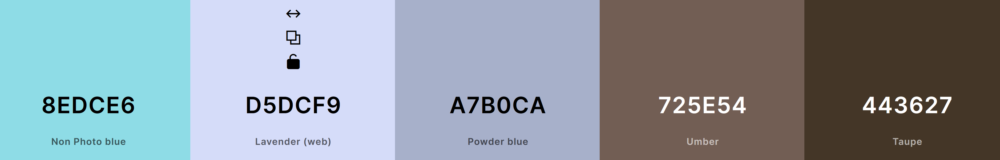

[PROJECT2FLAGIT](https://coelecanth.github.io/project2FlagIt)

[](https://github.com/Coelecanth/project2FlagIt/commits/main)
[](https://github.com/Coelecanth/project2FlagIt/commits/main)
[](https://github.com/Coelecanth/project2FlagIt)

# Flag-it! a Javascript Game by  Stewart Gibbons


# Introduction 
I chose to write a game as I saw this as challenge and to stretch my knowledge of javascipt. I chose a game as it was something I had never done before. This represented a technical challenge in managing a process of the game play. So as an example managing the game flow, making sure only the right resources are available a the right time during the game flow. 

ed based to identify the national flags of the world for several reasons. 
- Firtly it something I am really interested in temrs of travel and knowledge of other countrires.

[View the live project here.](https://coelecanth.github.io/project2FlagIt//)

# Game Design Story 
The name I chose for the game was "Flag-it!", this being an obvious reference to flags; but also the other reference in colloquail terms to highlight/illustrate something. Which given the game was all about finding the right name for a flag seemed apporpriatte. Lastly the expression of the words "flag-it" seemed very much to represent the spirit of the game of being fun and not too serious. 
Although there are simialr names for other types of web application being Used "Flag-It!" was not being used by other games. 

So when I started designing the game my intial idea for it requirement were to be visually pleasing and easy to understand with out the need for signficant explanation, more guidance. When I started rearching the idea looking at similer types of game, this list grew significantlty into the below criteria. 

- The game needed to be both educational and fun 
- Will be pleasing to use in terms of its colours, layout, and fonts
- layout should lend its elf to divide thgame play area into clearly understood regions e.g. 
    - Heading area
    - Flag area
    - Answer Area/panel 
    - Footer - with Copyright for the game and logos
    Acknowledgment to public domain images 
- Need to have the minimum amount of scrolling when actually playing the game   
- Needed to be able to provide a complete list of all recognised country flags
- The flags name and flag and image need to be accurate, this may seem obvious but alot of images and names are wrong due to changes in the country. 
- The game needed to be written with HTML and Javascipt.
- will also include the appropriate functional libraries for the above e.g. Jquery, Bootstrap 
## Game Features
Would include the following game features
- Game score feature, counting during the game, and summay a the end.
- Would show the correct answer when answering questions if you get it wrong
- Have a seperate learn the flags section where game player cna look at all flags and become familar with with the flags of each country
- Would be a multiple choice Question and asnswer game
- would show one flag image and mutiple answer, this was chosen to give a better performance 
when compared to display multiple images and a single answer.
- Would alter screen viewing pane to reduce the amount clutter and therfore scrolling when playing the game eg would hide elements that are not required such as the heading banner, text.
this will also be related to viewport size as well 
- include all (the vast majority) of world flags as recognised by an authorative body.
- Provide game options
    - To change the default number of questions to higher and lower number of questions
    - High score feature - although technicall this will only perssit locally and to the browser 
    - Provide access to diffeent game types, eg flags by region 
    - Alternative flag game - flags tahat are very similar in appearance to look at - "look-ee-likey game", and the answer would be all from same group of look-ee-likey flags

## UX design 
So manay of the features of the gamne I decided upon when researching the game were directly linked to the UX, these are detailed below 
- Game needed to be visually pleasing e.g layout and spacing and colours, fonts 
- It needed to be easier to understand with out explanation, more guidance. 
- The game needed to be both educational and fun, therfore engaging  
- Need to have the minimum amount of scrolling when actually playing the game   
    - When playing the game it would alter screen viewing pane to reduce scrolling
     e.g. would hide elements that are not required such as the heading banner, text.
- This same requirement would be necessary for responsiveness   
- The layout should lend it self to divide the game play area into clearly understood regions e.g. 
    - Heading area
    - Flag area
    - Answer Area/panel 
    - Footer - with Copyright for the game and logos
    - this would further aid the idea of responsive design and game play, eg I can just hide panesl i dont need on the page 
- Needed to be able to provide a complete list of all recognised country flags
- The flags name and flag image need to be accurate 
- Where beneficial the game should use appealing features like game modals and animation on buttons 

## Colour Scheme
Given the above features, I wanted a colour scheme that would provide contrast across the majority of the flags I wanted to show, and would be appealing.
I used the web site [coolors](https://coolors.co/) to find a colour scheme palette. The colour scheme design for this game that I chose, is to provide a passive game palette that had good contrast, and was not to sombre, as I wanted the game to be fun. 
I chose the below colour scheme.   

I used the colour scheme exclusively in my styling of the game (see below my CSS excerpt) but also added some highlight colours on the buttons to make them easily identifiable over the cooler colour scheme, and give the game some focus and fun.
```css
    /* #8edce6 - non-photo blue */
    /* #d5dcf9 - lavender */
    /* #a7b0ca  - powder blue */
    /* #725e54 - Umber */
    /* #443627 - Taupe  */
```

## Typography
ThefFonts I used were chosen from [Fontjoy.com](https://fontjoy.com/) which provides a mechanism to mix and match together fonts to provide aesthetically pleasing results, using there deep learning algorithm to produce matching fonts. 

The following 3 fonts were chosen to provide good contrast in styles to each other and be emapthise withe fun feel to the site.
I particually chose economica font as when it is used in italic its shape and form loook something similar to a waving flag. 
 - Economica - used for Heading and the waving Flag in italic
 - Josefin Slab - used for SUb heading 
 - Roboto Slab - used throughout as the default font 

I created an import statemnet to import these from Google, this was included in my style.ccs file, to download and include these in my game.

## Images
### Image Sources 
The digital image material required for the flag images are are piblic domain, 
I delibeately chose a single reliable source to acquire these images from. I acquired all the flag Images from [The CIA World Fact Book](https://www.cia.gov/the-world-factbook/references/flags-of-the-world/)
The reasoning for this was that alot of the flag images avaialble and there country are wrong due to names changes or changes in national status, such as:
- Czechia, formerly Czech Republic
- Eswatini, formerly Swaziland
So using this site where both the image and are believed to be correct was the reason for this decision. In addtion becuase of the prupose of the site I was able to procure a full set of 233 flags. 

The addiitonal Images I acquired for the game were obtained commercially through [IStock](https://www.istockphoto.com/) and this is used in the game on the home page [Flag Globe image](https://www.istockphoto.com/photo/world-flags-gm1140177392-305019555?searchscope=image%2Cfilm)
 
#### The umgpage.html 
The other images that I used for the game were manufactured by myself, 
they images created were:
- [Favicon](assets/img/flagiticon-1.avif)
- [Game Start](assets/img/start-game-new.avif) flag Icon

Using a web a page called [umpage.html](https://coelecanth.github.io/project2FlagIt/umgpage.html), I used the site colours and type formatting and styling to create the above web page as this was a very eay task having built the web site pages already. From this I then used a screen grab program, (windows snipit) to create the correct magnified image size in terms of the scale. These were then saved and hten transformed from jpg to Avif , to make them web friendly.  

### Wireframes
I produced wireframe for the game to illustrate the screen layout. I've used [Balsamiq](https://balsamiq.com/wireframes) to design my site wireframes.

| Wireframes for the Game | 
| ------------------------| 
| The below images show the Game home page and its make up  | 
|  |
| The below image shows the Game play page.  The image shown is the game screen in its original guise with the game play buttons shown left and right of the flag image. Due to an issue that was found with responsiveness, I had to change this format. Now all the buttons appear underneath the image. This is documented in the testing section of this README.md |
|  |  
| The below image shows the How to play page |
|  |
| The below image shows the study the flags page |                    
|  |

# Site Design Development  
## Site model 
intially I was working on site structure that would have had 2 pages utilisng modals so as to reduce duplication of similar pages. It quickly became apparent that the modal structure became too complicated to manage and develop in the time I had to complete this. With this consideration I reverted back to a more conventional structure using mutiple pages. However I still retained the modal pages for both the "end of game" screen and also for the "game options" panel. My evetual site structure is shown in the wireframes section.

## General page structure 
To give the game not only the look and feel I wanted but to ais inthe idea of responsiveness andallowing me to remove content dynamically, I divided the pages onthe site into severl structured and repeatabel panels as I was going gto ahve to reuse pages. 
the pages for the site comprise of the following Structure 
- Heading Banner 
- Flag Bannner 
- Answer Banner 
- Score Banner 
- Copyright Banner 
This allowed me to have, not only a consitent look and feel but applying syles to pages was far easier as it was consitent across pages.

In addtion to this there are 2 modal pages used from the game 
these are 
- End of Game Modal 
- Game Options Modal 
this as both present on the game page

### Game page 
The Panel layourwas used in full on this page Within the Panel I also used bootstrap grid, and Bootstrap was also used to make panels, text and icons 
 be responsive by removing them when not needed. 
 The game page has 2 Javascript files associatted with it one for the game, and a second which contians the JSON Array/dictionary for the flags and there attributes. 

### Study the Flags page
 Originally I wanted to use a modal driven panel to show all flags and then be able to open one of these and view it. 
 To do this effectively I would have to understood data and Iso for div tags, and i just did not have the time to inves in this.
 So I reverted back to using a page and then reusing a simplified verison of the GAme page javascriipt which would retrieve and load a singel flag on the click of a button. 
 In essence this page has its own javascript for the page which is a stripped doown verison of the game and still shares the JSON Array/dictionary for the flags. 

## Future Features 
There are a number of features which didnt make it into this version of the game and that i would have liked to have developed, these are: 
- All Time high Scores
- Multi Region Game
- The Look-ee-like-ee Game
- Where is that from?    

The following sections details the progress I made wih these 
### Future Developments
#### All Time High Scores  
 One feature which i would have liked to include in the game is to have persistent scores for 
 all time high score.
 The following code was trailled and updates the modal page to show this but in its cuurent guise only persists in the cuurent session of the game. 
 Once the page has been reloaded this information is lost. To enhance this further, development is needed to add using "localstorage" to store this information in a cookie, and then this would persist in the game for that browser on that machine, ideally a backend solution is required to store the game high scores, where a web service would capture during the data during game play and then store this, this then could be restored from the web service when a new session is started, regard less of browser and/or machine.   

```javascript 
function gethighScores() {
// check high scores
hScoreValQ = parseInt(hScore.innerText, 10) 
hScoreTotQ = parseInt(hScoreQ.innerText, 10)

// read high score from modal checks > x then set value 
if (correctQuestions.innerText > hScoreValQ) {
    $("#h-score").text(correctQuestions.innerText)
    $("#h-score-q").text(maxQuestions)
}
}  
```    
#### Multi Region Game 
I was developing a new feature for the game where you could select a region in the world where flags were from these were idenitified by 
field in the JSON array called territory. 
There are 5 territories contained in flag-dict.js which are  
- Asia 
- Oceania  
- Americas 
- Europe 
- Africa   
 
 Code below would firstly take input from the button shown in the modal game options. The id from the button is the same 
 as the value in territory eg "(id Oceania) == (territory  Oceania)", once this has been captured a negative match ("!= All") is made. Then the 
 the function arrFilter is called passing the id to the function from here new array is loaded and shuffled to produce the chosen scope
 The initNewgame function is called to start the game.   
 
 ```javascript 
    //captures input from modal  
    //change game type, eg capture flags a region
    modChgFg()
    function modChgFg() {
       $('.f-class').on("click", function () {
       gameFilter = (this.id); 
       if (gameFilter != "All") {
         // call function to create new arry with territory filter
        arrFilter(gameFilter)
         //show text with game type on page
        $(".ps-game").show();
        $("#" + "flag-game-type").html(gameFilter + ` Flags`)
        initNewgame(filteredArr)
    } else { 
         // gameFilter is set to "All" 
         //once closed now start game
        $("#GameEndModal").on("hide.bs.modal", function () {
        initNewgame("All")
        });
       }
      });
     }
    function arrFilter(idRegion) {
        let filteredArr = [];
        for (let i = 0; i < shuffled.length; i++) {
            if (shuffled[i].territory === idRegion) {
                filteredArr = [...filteredArr, shuffled[i]];
            }
        }
    }
```

This feature was included, but requires more work to complete, by revising the initNewgame, to accpet both inputs from the regions and all flags (eg current game flow), 
Together with associatted testing required to check for alterations in the game flow and there fore erronous states.  

#### The Look-ee-like-ee Game 
I was developing a new feature for the game where you could a select game which selected a grouping of flags which are similar in colour and make up.  
To enable this feature I extend the JSON file flag-dict.js and added a further named value in it of "lookelike" this contians a number which represent a grouping of flags, there are 47 Flag groupings.
So the game would consist of loading 47 groups with an array of 4 flags in each, and then the game would be of 47 questions, with a differnt flag group for each question. The following code example show the structure oif the JSOn file. The full file has been included /assets/js/flag-dict2.js 
 ```javascript
    const countryArray = [
    {
      "country": "Afghanistan",
      "flag-name": "AF-flag.jpg",
      "territory": "Asia",
      "lookelike": 4
    },
    {
      "country": "Albania",
      "flag-name": "AL-flag.jpg",
      "territory": "Europe",
      "lookelike": 33
    },
    {
      "country": "Algeria",
      "flag-name": "AG-flag.jpg",
      "territory": "Africa",
      "lookelike": 18
    },
    ]
```
#### Where is that from? 
Where is that from or WITF is really an idea, at present. Where the game would presnt you with a Flag and then ask you to correctly identify the corect geography (territory) from where its from, such A: Oceania, B: Europe, C: Asia, D: Americas. 
The territory could be shuffled to give you more variety in the Questions. This some what departs from the flag idea as this now becomes more a geography knowledge quiz.    

# Technologies Used 

## Languages
1. HTML5
2. CSS3
3. Javascript 

## Frameworks, Libraries, Sites, Services & Programs Used
### 1. [Bootstrap 5.3](https://getbootstrap.com/docs/5.3/getting-started/introduction/)
- Bootstrap was used to assist with the capabiliites and responsiveness and styling of the website. It is used througout the site.
### 2. [JQuery ](https://jquery.com)  
- jQuery was used extensively to control and alter the HTML elements within the page. 
### 3. [Git](https://git-scm.com/) 
- Git was used for version control by utilizing the Gitpod terminal to commit to Git and Push to GitHub.
### 4. [GitHub:](https://github.com/) 
- GitHub is used to store the projects code after being pushed from Git.
### 5. [GitPod](https://www.gitpod.io/)
- Gitpod was the IDE that i used to edit and build the html pages in, and dvelope an debug the javascript code with. 
 ### 6. [Squoosh](https://squoosh.app/)
- Squooosh was used to perform the following functions 
- convert the images from jpg to Avif 
- Also to resize (reduce pixel count) the images to a more managable size to improve download speed.
### 7. [Google Fonts](https://fonts.google.com/)
- Google fonts was used to source the fonts that were sleected from Fontjoy. 
### 8. [StackOverflow](https://stackoverflow.com/) 
- Stack overflow was an invaluable resource I used for code validation, examples and research.
### 9. [FontJoy](https://fontjoy.com/)
- Font joy was used in the design process to create a palette of fonts, to be empathic with the site topic, and provide contrast between various type stying. 
- **Quote** from https://fontjoy.com/  
 *The goal of font pairing is to select fonts that share an overarching theme yet have a pleasing contrast. Which fonts work together is largely a matter of intuition, but we approach this problem with a neural net.*


# Testing

## High Level Test Strategy 
- Responsiveness -  tested across mutiple screen size and devices 
- User testing - Game flow and interaction 
- Javascript operation - 
- javascript automated testing  
- validation using Jhint, w3c, 
- performance using lighthouse, gtmetrix 


## Device base 
The follwoing devices were tested against, these were selected to provide a broad but common base of devices  

Emulated devices using Google Chrome emulator   
- Iphone XR 
- galaxy s20 
- Ipad mini 
- Kindle fire 
- Ipad Pro
Physical device 
- PC desktop -  Firefox, Chrome, and Edge
- Samsung s22 Ultra - Firefox and Chrome 
- Samsung s20 Ultra 
- Samsung Flip     
- iphone XR
### Browser 
The site was tested on the following browsers acroos the above devices :
 - Safari
 - Google Chrome
 - Mozilla Firefox
 - Microsoft Edge

The testing on these platfroms was exercising the game and looking for any erronous behaviour/situations that developed. 
Where this batch of testing produced problems, those that required real remdiatation are documented in the Testing section

## MarkUp Validation -  
The W3C Markup Validator and W3C CSS Validator Services were used to validate all page of the project to ensure there were no syntax errors in the project.
- W3C Markup Validator - Results can be seen in TESTING.md including errors and final validation
-  W3C CSS Validator - - Results can be seen in TESTING.md including errors and final validation

## JS automated testing
using JEST 

## Performance Testing  
### [GtMetrix](https://gtmetrix.com/) Testing 

### lighthouse 

# Testing Issues and Resolution

### 1. Bug - Game Flow behaviour after Start Pressed  
Problem found when AFTER the "Start" button is clicked in the game, the "Next" and "Restart Game" button is active even though no answer has been selected.
This would cause the game to go into a dead game state and you would have to relaod the page.  
### Resoloution 
The resolution to this was to hide the buttons so that they could not used and thi also follows the idea of removing game estate to make the game more playable. what was perfomred was to hide the buttons until after an answer button had been pressed. 


### 2. Bug - Game Flow behaviour with reset Button after start 
Steps to reproduce 
1. Once a game has been played (and scores are recorded). 
2. The player then presses Start and the game is started again. 
3. If you now press the reset button, having not selected any answers, 
4. The game ends, and "End of Game" Modal is shown, and the scores from the previous game are shown. 
the scores should have been zeroed at the end of the game in step 1

#### Resolution 
This happens as the scores have been written to the modal page, and the modal page values had not 
been reset as part of the restart process. 
This was fixed by resetting the scores values in the modal page as part of the reset.

### 3. Bug - Game Responsiveness with Game page when playing 
|Responsiveness of the main flag panel on small screens| 
| ------------------------| 
| The below images show the issue | 
|  |
 
 To control the space in the Flag Panel I used the boot strap grid, with 1 row and 3 columns. 
 This gave me alignmnet and spacing, but becuas the game hides buttons at different points of the game 
 and when playing on small dvives it would cause the last column to wrap, causing the flag and butons to lose all ther ealignment.

 #### Resolution 
  The resolution to this was to change the Bootstrap grid to 3 rows, with one column in each row, 
  and set the buttons to be displayed in a block in the column.
  This then aligns the buttons and image without issue, and resizes gracefully as the screen port chjanges.   
   


### 4 Game Responsiveness of the Footer on Small Screens 
On reducing the viewport size the responsiveness would alter both image and
banner cuasing the the image and text to clash 

|Responsiveness of the footer on small screens| 
| ------------------------| 
| The below images show the issue | 
|  |
#### Resolution
Intially i reoslved this by hiding the flag Icon at small screen size using bootstrap 
setting for small on the image eg d-none d-sm-none d-md-block. However upon 
reviewing this further when using some of the other pages the texts was causing an issue, 
reducing the text size just made the copyright unreadable. So it became advantagous just to hide 
the whole copyright banner at small screen sizes, on all pages except the home page. 
Which still retains the text.     

### 5 Game Flow - Game page
A bug was found where it was still possible to press an answer button when the game had finished. 
This would cause the game to go into a dead game state and you would have to relaod the page. 
#### Resolution
This was caused by some additions I had made to the game flow in the End of game routines and these 
had been added in the wrong place, this was rectified by altering the postions of statements 
eg the disable the answer buttons  

# Acknowledgements

- My thanks to Tim Nelson my Mentor who provides extensive and deep insite in to the subject matter, who has been an absolute valued help.

- Ben Smith my tutor for continuous helpful input and feedback

- Friends and family for valuable insights and feedback

## Credits 
- Tim Nelson - ["Vexill-Uhm?"](https://traveltimn.github.io/guess-the-flag/)
- Tim Nelson - [Mardown Builder](https://tim.2bn.dev/markdown-builder/)

## Deployment

The site was deployed to GitHub Pages. The steps to deploy are as follows:

- In the [GitHub repository](https://github.com/Coelecanth/project2FlagIt), navigate to the Settings tab 
- From the source section drop-down menu, select the **Main** Branch, then click "Save".
- The page will be automatically refreshed with a detailed ribbon display to indicate the successful deployment.

The live link can be found [here](https://coelecanth.github.io/project2FlagIt)

### Local Deployment

This project can be cloned or forked in order to make a local copy on your own system.

#### Cloning

You can clone the repository by following these steps:

1. Go to the [GitHub repository](https://github.com/Coelecanth/project2FlagIt) 
2. Locate the Code button above the list of files and click it 
3. Select if you prefer to clone using HTTPS, SSH, or GitHub CLI and click the copy button to copy the URL to your clipboard
4. Open Git Bash or Terminal
5. Change the current working directory to the one where you want the cloned directory
6. In your IDE Terminal, type the following command to clone my repository:
	- `git clone https://github.com/Coelecanth/project2FlagIt.git`
7. Press Enter to create your local clone.

Alternatively, if using Gitpod, you can click below to create your own workspace using this repository.

[](https://gitpod.io/#https://github.com/Coelecanth/project2FlagIt)

Please note that in order to directly open the project in Gitpod, you need to have the browser extension installed.
A tutorial on how to do that can be found [here](https://www.gitpod.io/docs/configure/user-settings/browser-extension).

#### Forking

By forking the GitHub Repository, we make a copy of the original repository on our GitHub account to view and/or make changes without affecting the original owner's repository.
You can fork this repository by using the following steps:

1. Log in to GitHub and locate the [GitHub Repository](https://github.com/Coelecanth/project2FlagIt)
2. At the top of the Repository (not top of page) just above the "Settings" Button on the menu, locate the "Fork" Button.
3. Once clicked, you should now have a copy of the original repository in your own GitHub account!


