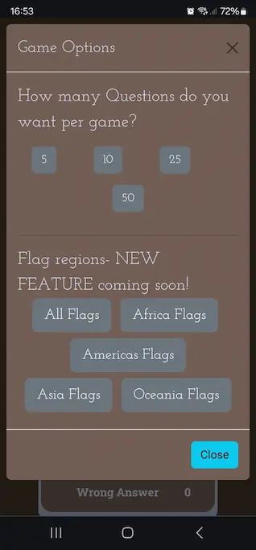

# Testing

> [!NOTE]  
> Return back to the [README.md](README.md) file.

# High Level Test Strategy 
The following test wer carried while developn ghte game and resolving issues during dveopment 
- Responsiveness -  tested across mutiple screen size and devices 
- User testing - Game flow and interaction 
- Javascript operation 

The game was given to players (friends and Family x 6)  who had no breifing on the game asked to test on a device 
The majoirty of these were mobile devices of various kinds.  

## Device base 
The following devices were tested on, the emaulted ones were selected to provide a broad but common base of devices.  

Emulated devices using Google Chrome emulator   
- Iphone XR 
- galaxy s20 
- Ipad mini 
- Kindle fire 
- Ipad Pro

Physical device 
- PC desktop -  Firefox, Chrome, and Edge
- Samsung s22 Ultra - Firefox and Chrome 
- Samsung s20 Ultra 
- Samsung Flip     
- iphone XR

### Browser 
The site was tested on the following browsers across the above devices :
 - Safari - mobile only
 - Google Chrome
 - Mozilla Firefox
 - Microsoft Edge

In addtition to this user centric testing, validation was performend in the following ways  
- javascript automated testing  
- validation of code - see section below  
- performance of pages/code - see section below 

## Test plan
User centric testing on was really completed by exercising the game and looking for any erronous behaviour/situations that developed. in particular 
I tested the following features when exercising the game

- Game page responsiveness 
- User features - reduce scrolling while playing 
- User feature - Questions for game change - Game Options Modal 
- User faeture - Game End Modal 
- User features - navigation bar works - documented in responsiveness section 
    - changes size when viewport reduces 
    - navbar reduces and enalrges on viewport change


Where testing produced problems/bugs, those that required remediation are documented in the Testing Issues and Resolution section

## JS automated testing
using JEST 


## Code Validation
The following sections details the validation that I put the "Flag-It!" site through to vlaidate ht efollwoing elelemts 
- Html
- CSS
- JAvascript

### HTML
I have used the recommended [HTML W3C Validator](https://validator.w3.org) to validate all of my HTML files.
| Directory | File | Screenshot | Notes |
| --- | --- | --- | --- |
|  | game.html |  | |
|  | htp.html |  | |
|  | index.html |  | |
|  | stf.html |  | |


### CSS
I have used the recommended [CSS Jigsaw Validator](https://jigsaw.w3.org/css-validator) to validate all of my CSS files.

| Directory | File | Screenshot | Notes |
| --- | --- | --- | --- |
| assets | style.css |  | |

### JavaScript

I have used the recommended [JShint Validator](https://jshint.com) to validate all of my JS files.
 When I ran jshint one error I could not remove was that one of the statements was calling the countryArray which was external to the file, so hence could not be resolved.
 Like waise as the flag-dict.js just defines an array, there is no calling function in the file, because the calling function are in the script files. 
 Apart from these anomalies the files were clean 
| Directory | File | Screenshot | Notes |
| --- | --- | --- | --- |
| assets | flag-dict.js |  | no errors except expected|
| assets | game.js |  | no errors except expected|
| assets | stf.js |  | no errors except expected|

## Browser Compatibility

I've tested my deployed project on multiple browsers to check for compatibility issues.
These would include.

- [Chrome](https://www.google.com/chrome)
- [Firefox (Developer Edition)](https://www.mozilla.org/firefox/developer)
- [Edge](https://www.microsoft.com/edge)

| Browser | Home | Game | Contact | etc | Notes |
| --- | --- | --- | --- | --- | --- |
| Chrome |  |  Works as expected |
| Firefox |  |  Works as expected |
| Edge |  | Works as expected |

## Responsiveness

I tested the site acroos these types of dvices 
- Mobile
- Tablet
- Desktop

I've tested my deployed project on multiple devices to check for responsiveness issues.

| Device | Home | Game | Notes |
| --- | --- | --- | --- |
| Mobile (DevTools) |  |  | Works as expected |
| Tablet (DevTools) |  |   | Works as expected |
| Desktop |  |  | Works as expected |
| XL Monitor |  |  | Works as expected |
| 
## Lighthouse Audit

I've tested my deployed project using the Lighthouse Audit tool to check for any major issues.

| Page |Desktop |  Notes |
| --- | --- | --- |
| Home |   | No performance issue detected  |
| game |  |  No performance issue detected |


### Defensive Testing Issues and Resolution

### 1. Bug - Game Flow behaviour after Start Pressed  
Problem found when AFTER the "Start" button is clicked in the game, the "Next" and "Restart Game" button is active even though no answer has been selected.
This would cause the game to go into a dead game state and you would have to relaod the page.  
### Resoloution 
The resolution to this was to hide the buttons so that they could not used and thi also follows the idea of removing game estate to make the game more playable. what was perfomred was to hide the buttons until after an answer button had been pressed. 


### 2. Bug - Game Flow behaviour with reset Button after start 
Steps to reproduce 
1. Once a game has been played (and scores are recorded). 
2. The player then presses Start and the game is started again. 
3. If you now press the reset button, having not selected any answers, 
4. The game ends, and "End of Game" Modal is shown, and the scores from the previous game are shown. 
the scores should have been zeroed at the end of the game in step 1

#### Resolution 
This happens as the scores have been written to the modal page, and the modal page values had not 
been reset as part of the restart process. 
This was fixed by resetting the scores values in the modal page as part of the reset.

### 3. Bug - Game Responsiveness with Game page when playing 
|Responsiveness of the main flag panel on small screens| 
| ------------------------| 
| The below images show the issue | 
|  |
 
 To control the space in the Flag Panel I used the boot strap grid, with 1 row and 3 columns. 
 This gave me alignmnet and spacing, but becuas the game hides buttons at different points of the game 
 and when playing on small dvives it would cause the last column to wrap, causing the flag and butons to lose all ther ealignment.

 #### Resolution 
  The resolution to this was to change the Bootstrap grid to 3 rows, with one column in each row, 
  and set the buttons to be displayed in a block in the column.
  This then aligns the buttons and image without issue, and resizes gracefully as the screen port chjanges.   
   

### 4 Game Responsiveness of the Footer on Small Screens 
On reducing the viewport size the responsiveness would alter both image and
banner cuasing the the image and text to clash 

|Responsiveness of the footer on small screens| 
| ------------------------| 
| The below images show the issue | 
|  |
#### Resolution
Intially i reoslved this by hiding the flag Icon at small screen size using bootstrap 
setting for small on the image eg d-none d-sm-none d-md-block. However upon 
reviewing this further when using some of the other pages the texts was causing an issue, 
reducing the text size just made the copyright unreadable. So it became advantagous just to hide 
the whole copyright banner at small screen sizes, on all pages except the home page. 
Which still retains the text.     

### 5 Game Flow - Game page
A bug was found where it was still possible to press an answer button when the game had finished. 
This would cause the game to go into a dead game state and you would have to relaod the page. 
#### Resolution
This was caused by some additions I had made to the game flow in the End of game routines and these 
had been added in the wrong place, this was rectified by altering the postions of statements 
eg the disable the answer buttons  


## User Story Testing

### User Story Testing 
Reduce scrolling feature


| User Story | Screenshot |
| --- | --- |
| As a site player, I would like the intereface to reduce the clutter when playing, so that I am not distracted or constanly scrolling  |  |
| As a site player, I would like the intereface to show me the correct answer when i get a question Wrong |  |
| As a site player, I would like the intereface to show my score for the last played game |  |
| As a site player, I would like the intereface to pause when the game ends so I can see the last answer is correct or wrong |  |
| As a site player, I would like the game to change the number of questions I can play. |  |
| Have a seperate learn the flags section where game player can look at all flags and become familar with with the flags of each country |  |
 

## Automated Testing

I have conducted a series of automated tests on my application.

I fully acknowledge and understand that, in a real-world scenario, an extensive set of additional tests would be more comprehensive.

### JavaScript (Jest Testing)

🛑🛑🛑🛑🛑🛑🛑🛑🛑🛑-START OF NOTES (to be deleted)

Adjust the code below (file names, etc.) to match your own project files/folders.

🛑🛑🛑🛑🛑🛑🛑🛑🛑🛑-END OF NOTES (to be deleted)

I have used the [Jest](https://jestjs.io) JavaScript testing framework to test the application functionality.

In order to work with Jest, I first had to initialize NPM.

- `npm init`
- Hit `enter` for all options, except for **test command:**, just type `jest`.

Add Jest to a list called **Dev Dependencies** in a dev environment:

- `npm install --save-dev jest`

**IMPORTANT**: Initial configurations

When creating test files, the name of the file needs to be `file-name.test.js` in order for Jest to properly work.

Without the following, Jest won't properly run the tests:

- `npm install -D jest-environment-jsdom`

Due to a change in Jest's default configuration, you'll need to add the following code to the top of the `.test.js` file:

```js
/**
 * @jest-environment jsdom
 */

const { test, expect } = require("@jest/globals");
const { function1, function2, function3, etc. } = require("../script-name");

beforeAll(() => {
    let fs = require("fs");
    let fileContents = fs.readFileSync("index.html", "utf-8");
    document.open();
    document.write(fileContents);
    document.close();
});
```

Remember to adjust the `fs.readFileSync()` to the specific file you'd like you test.
The example above is testing the `index.html` file.

Finally, at the bottom of the script file where your primary scripts are written, include the following at the bottom of the file.
Make sure to include the name of all of your functions that are being tested in the `.test.js` file.

```js
if (typeof module !== "undefined") module.exports = {
    function1, function2, function3, etc.
};
```

Now that these steps have been undertaken, further tests can be written, and be expected to fail initially.
Write JS code that can get the tests to pass as part of the Red-Green refactor process.

Once ready, to run the tests, use this command:

- `npm test`

**NOTE**: To obtain a coverage report, use the following command:

- `npm test --coverage`

Below are the results from the tests that I've written for this application:

| Test Suites | Tests | Screenshot |
| --- | --- | --- |
| 1 passed | 16 passed |  |
| x | x | repeat for all remaining tests |

#### Jest Test Issues

🛑🛑🛑🛑🛑🛑🛑🛑🛑🛑-START OF NOTES (to be deleted)

Use this section to list any known issues you ran into while writing your Jest tests.
Remember to include screenshots (where possible), and a solution to the issue (if known).

This can be used for both "fixed" and "unresolved" issues.

🛑🛑🛑🛑🛑🛑🛑🛑🛑🛑-END OF NOTES (to be deleted)

## Bugs
 see section on Defensive Testing Issues and Resolution

## Unfixed Bugs

### Randomising Issue
- When randomising the array for the flags, its possible you will get duplicate flags appears as questions in the same game, although the answer to the question are different. 
It is more prevalent on game with more questions 

    this appears randomly so it weas not poossibel to document it with images 

    - Fix : would need to be retain the same array throughou the cuurent game and then using something shift to remove the first elelemnt in the array. As this is the corect answer for the question
    I did attempt to resolve this but it was a minor issue, and was concentrating on adding features to the game to complate.  
### Extreme screen size, flag panel is not responsive  
- When showing the game on very large screens resolution over 2022 x 980 the Flag Panel during the game does not flex correctly  

     

    - I suspect this somethign to do with the bootstrap setting being used, but I ran out of time to resovle this 

